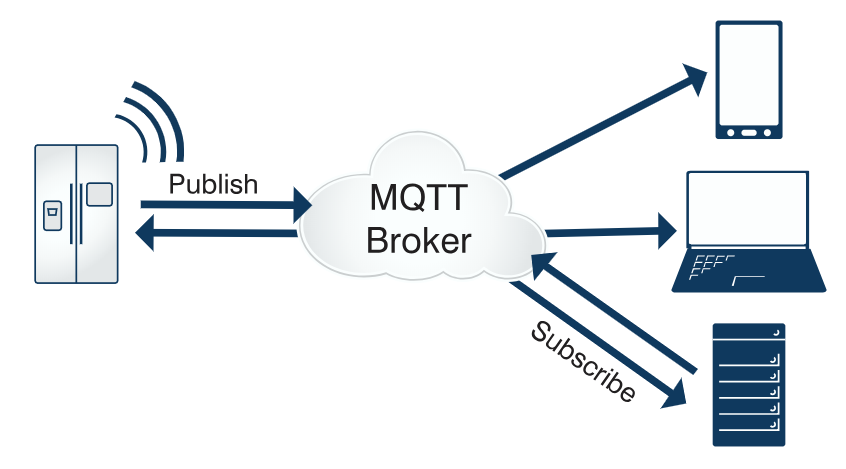

# Huawei LiteOS IEC端云互通组件

# 开发指南

## 目 录

- [1 知识共享许可协议说明](#1)
- [2 前言](#2)
- [3 设备接入IEF集成开发流程](#3)
  - [3.1 环境准备](#3.1)
  - [3.2 创建设备模板和设备](#3.2)
  - [3.3 IEF互通组件设备接入平台](#3.3)
- [4 附录1 MQTT协议介绍](#4)
  - [4.1 MQTT协议是什么](#4.1)
  - [4.2 MQTT设计特性](#4.2)
  - [4.3 MQTT体系架构](#4.3)
  - [4.4 MQTT协议原理](#4.4)

<h2 id="1">1.知识共享许可协议说明</h2>

**您可以自由地：**

**分享** — 在任何媒介以任何形式复制、发行本作品

**演绎** — 修改、转换或以本作品为基础进行创作

只要你遵守许可协议条款，许可人就无法收回你的这些权利。

**惟须遵守下列条件：**

**署名** —
您必须提供适当的证书，提供一个链接到许可证，并指示是否作出更改。您可以以任何合理的方式这样做，但不是以任何方式表明，许可方赞同您或您的使用。

**非商业性使用** — 您不得将本作品用于商业目的。

**相同方式共享** —
如果您的修改、转换，或以本作品为基础进行创作，仅得依本素材的授权条款来散布您的贡献作品。

**没有附加限制** —
您不能增设法律条款或科技措施，来限制别人依授权条款本已许可的作为。

**声明：**

当您使用本素材中属于公众领域的元素，或当法律有例外或限制条款允许您的使用，则您不需要遵守本授权条款。

未提供保证。本授权条款未必能完全提供您预期用途所需要的所有许可。例如：形象权、隐私权、著作人格权等其他权利，可能限制您如何使用本素材。


为了方便用户理解，这是协议的概述。您可以访问网址https://creativecommons.org/licenses/by-nc-sa/3.0/legalcode

了解完整协议内容。

<h2 id="2">2.前言</h2>

**目的**

本文档用于指导开发者了解Huawei LiteOS IEC端云互通组件，能够基于LiteOS
IEC对接IEF，开发自己的物联网应用。

**读者对象**

本文档主要适用于Huawei LiteOS的开发者。

本文档主要适用于以下对象：

- 物联网端侧软件开发工程师
- 物联网架构设计师

**符号约定**

在本文中可能出现下列标志，它们所代表的含义如下。

| 符号                                 | 说明                                                         |
| ------------------------------------ | ------------------------------------------------------------ |
|  | 用于警示潜在的危险情形，若不避免，可能会导致人员死亡或严重的人身伤害 |
|  | 用于警示潜在的危险情形，若不避免，可能会导致中度或轻微的人身伤害 |
|  | 用于传递设备或环境安全警示信息，若不避免，可能会导致设备损坏、数据丢失、设备性能降低或其它不可预知的结果 “注意”不涉及人身伤害 |
|  | “说明”不是安全警示信息，不涉及人身、设备及环境伤害信息       |

**术语**

| 序号 |  术语名称   | 描述                                                         |
| ---- |  ------------  | ---------------------------------------------------------- |
| 1    | LiteOS IEC | LiteOS SDK是Huawei LiteOS软件开发工具包（Software Development Kit），包括端云互通组件、FOTA、JS引擎、传感框架等内容。 |
| 2    | IEF        | 智能边缘平台（Intelligent EdgeFabric ）满足客户对边缘计算资源的远程管控、数据处理、分析决策、智能化的诉求， 为用户提供完整的边缘和云协同的一体化服务。 |

<h2 id="3">3.设备接入IEF集成开发流程</h2>

本章内容旨在帮助开发者在IoT设备上集成LiteOS IEC端云互通组件，进行IoT应用开发和调测。LiteOS IEC端云互通组件接入华为IEF云平台默认采用的是以太网方式（即以太网口驱动+LwIP网络协议栈+MQTT协议+LiteOS
IEC端云互通组件对接云平台）。

<h3 id="3.1">3.1环境准备</h3>

在开发之前，需要提前获取如下信息：

- Huawei LiteOS及LiteOS SDK源代码

> 目前托管在GitHub，地址为<https://github.com/LiteOS/LiteOS_IEC>

- 开发者的访问地址/账号/密码

> 需要向IEF平台申请。

- 设备对接地址/端口号

<h3 id="3.2">3.2创建设备模板和设备</h3>

通过创建应用，开发者可以根据自身应用的特征，选择不同的平台服务套件，降低应用开发难度。

- **步骤1** 登录IEF平台的页面<https://www.huaweicloud.com/product/ief.html>。账号和密码请注册并等待验证通过。
- **步骤2** 登陆之后请首先创建设备和设备模板

**创建设备模板**


点击“创建设备模板”，在新弹出窗口中，配置设备模板信息，点击“创建”。

**创建设备**


点击“创建设备”，在新弹出窗口中，配置设备模板信息，点击“创建”。注意选择设备类型为直连设备。


点击“创建”创建成功后，会生成设备证书并自动下载。


证书的压缩包cert.tar.gz包含三个文件：服务器的CA证书，客户端的证书和客户端的key：


<h3 id="3.3">3.3 IEF互通组件设备接入平台</h3>

设备接入IEF平台后，IEF平台才可以对设备进行管理。设备接入平台时，需要保证IEF平台已经有对应设备。

#### 3.3.1 开发环境准备

- 集成开发工具：
  - MDK 5.18版本或者以上版本，从MDK官方网站下载。
  - MDK依赖的pack包

> 说明：MDK工具需要license，请从MDK官方获取。

- LiteOS IEC端云互通组件代码：

  git clone https://github.com/LiteOS/LiteOS_IEC.git

- 硬件设备：野火STM32F429开发板，调试下载器（J-Link、ST-Link等）、网线、路由器。

#### 3.3.2 开发板硬件介绍

本文档以野火STM32F429IG开发板为例进行介绍，板子的详细资料可以从<http://www.firebbs.cn/forum.php>下载。

**STM32F429IG_FIRE开发板外设**


#### 3.3.3设备接入开发步骤

**步骤1** 开发板的网口通过网线连接到路由器。

**步骤2** 设置本地IP。

在sys_init.c中修改device接入的局域网的IP地址值。（注：目前demo程序采用的是静态IP地址的方式，如果需要使用DHCP方式，请在main.c中顶部头文件包含之后定义USE_DHCP宏即可）

```
void net_init(void)
{
    /* IP addresses initialization */
    IP_ADDRESS[0] = 192;
    IP_ADDRESS[1] = 168;
    IP_ADDRESS[2] = 0;
    IP_ADDRESS[3] = 115;
    NETMASK_ADDRESS[0] = 255;
    NETMASK_ADDRESS[1] = 255;
    NETMASK_ADDRESS[2] = 255;
    NETMASK_ADDRESS[3] = 0;
    GATEWAY_ADDRESS[0] = 192;
    GATEWAY_ADDRESS[1] = 168;
    GATEWAY_ADDRESS[2] = 0;
    GATEWAY_ADDRESS[3] = 1;
}
```

**步骤3** 网口的mac地址修改。

在eth.c中将MAC_ADDR0\~MAC_ADDR5修改成真实的mac地址值保证不重复。

```
static int8_t eth_init(struct netif* netif)
{
    HAL_StatusTypeDef hal_eth_init_status;
    MACAddr[0] = 0x00;
    MACAddr[1] = 0x80;
    MACAddr[2] = 0xE1;
    MACAddr[3] = 0x00;
    MACAddr[4] = 0x00;
    MACAddr[5] = 0x00;
}
```

**步骤4** 设置IEF客户端ID、云平台IP、证书和IEC_PROJECT_ID、IEC_DEVICE_ID。

Client ID

在iec_config.h中：
```
#define IEC_CLIEND_ID           "LiteOS_IEC"
```
云平台IP

在iec_config.h中：

```
#define SERVER_IP "122.112.225.88"
```

CA证书

在iec_config.h中的MQTT_TEST_CA_CRT宏定义，使用*_ca.crt

客户端证书

在iec_config.h中的MQTT_TEST_CLI_CRT宏定义，使用*_private_cert.crt

客户端key

在iec_config.h中的MQTT_TEST_CLI_KEY宏定义，使用*_private_cert.key.

IEC_PROJECT_ID和IEC_DEVICE_ID

```
#define IEC_PROJECT_ID "cb1d33433e2648b0a0f40ad1a0c5ffbb"
#define IEC_DEVICE_ID "894d48f8-45c0-4ac4-8d18-f5b983ef9159"
```

这两项配置可以查看private_cert.crt中：


其中：“.”之前的字串为IEC_PROJECT_ID，"."之后的字串为IEC_DEVICE_ID。

**步骤5** 在具体硬件STM32F429IGTx_FIRE中运行，在targets/Cloud_STM32F429IGTx_FIRE/GCC目录下make编译。若想在linux上运行，在targets/IEC_Linux_Project目录下make编译。

**步骤6** 查看设备状态。

登录IEF平台，选择“设备管理”，在设备列表中查看对应设备的状态。如果状态为“online”，则表示设备已经成功接入IoT平台。

**查看设备状态**


1.对于publish来的message的处理都在各个*_message_cb函数中，请自行添加具体的处理，默认打印message。

<h2 id="4">4.附录MQTT协议介绍</h2>

<h3 id="4.1">4.1 MQTT协议是什么</h3>

MQTT（Message Queuing Telemetry Transport），是一种基于CS架构下发布/订阅（publish/subscribe）模式的消息传输协议，该协议构建于TCP/IP协议上。MQTT最大优点是轻量级，开放，简单，设计便于使用；因此可以以在包括受限的环境中运行。如：机器与机器（M2M）通信和物联网（IoT）。

<h3 id="4.2">4.2 MQTT设计特性</h3>

考虑到IoT和M2M的实际场景，MQTT的设计有如下特性：

- （1）精简；

- （2）发布/订阅（Pub/Sub）模式，方便消息在传感器网络之间传递；

- （3）允许用户动态创建主题，零运维成本；

- （4）把传输量降到最低以提高传输效率；

- （5）考虑低带宽、高延迟、不稳定的网络等因素；

- （6）支持连续的会话控制；

- （8）提供服务质量管理；

- （9）假设数据不可知，不强求传输数据的类型与格式，保持灵活性。

<h3 id="4.3">4.3 MQTT体系架构</h3>

MQTT体系架构如图所示：

**MQTT体系架构**



<h3 id="4.4">4.4 MQTT协议原理</h3>

#### 4.4.1 MQTT协议实现方式

实现MQTT协议需要客户端和服务器端通讯完成，在通讯过程中，MQTT协议中有三种身份：发布者（Publisher）、代理（Broker）（服务器）、订阅者（Subscriber）。其中，消息的发布者和订阅者都是客户端，消息代理是服务器，消息发布者可以同时是订阅者。

MQTT传输的消息分为：主题（Topic）和负载（Payload）两部分：

- Topic，可以理解为消息的类型，订阅者订阅（Subscribe）后，就会收到该主题的消息内容（Payload）；
- Payload，可以理解为消息的内容，是指订阅者具体要使用的内容。

#### 4.4.2 网络传输与应用消息

MQTT会构建底层网络传输：它将建立客户端到服务器的连接，提供两者之间的一个有序的、无损的、基于字节流的双向传输。

当应用数据通过MQTT网络发送时，MQTT会把与之相关的服务质量（QoS）和主题名（Topic）相关连。

#### 4.4.3 MQTT客户端

一个使用MQTT协议的应用程序或者设备，它总是建立到服务器的网络连接。客户端可以：

- 发布其他客户端可能会订阅的信息；
- 订阅其它客户端发布的消息；
- 退订或删除应用程序的消息；
- 断开与服务器连接。

#### 4.4.4 MQTT服务器

MQTT服务器以称为"消息代理"（Broker），可以是一个应用程序或一台设备。它是位于消息发布者和订阅者之间，它可以：

- 接受来自客户的网络连接；
- 接受客户发布的应用信息；
- 处理来自客户端的订阅和退订请求；
- 向订阅的客户转发应用程序消息。

#### 4.4.5 MQTT协议中的订阅、主题、会话

**一、订阅（Subscription）**

订阅包含主题筛选器（Topic Filter）和最大服务质量（QoS）。订阅会与一个会话（Session）关联。一个会话可以包含多个订阅。每一个会话中的每个订阅都有一个不同的主题筛选器。

**二、会话（Session）**

每个客户端与服务器建立连接后就是一个会话，客户端和服务器之间有状态交互。会话存在于一个网络之间，也可能在客户端和服务器之间跨越多个连续的网络连接。

**三、主题名（Topic Name）**

连接到一个应用程序消息的标签，该标签与服务器的订阅相匹配。服务器会将消息发送给订阅所匹配标签的每个客户端。

**四、主题筛选器（Topic Filter）**

一个对主题名通配符筛选器，在订阅表达式中使用，表示订阅所匹配到的多个主题。

**五、负载（Payload）**

消息订阅者所具体接收的内容。

#### 4.4.6 MQTT协议中的方法

MQTT协议中定义了一些方法（也被称为动作），来于表示对确定资源所进行操作。这个资源可以代表预先存在的数据或动态生成数据，这取决于服务器的实现。通常来说，资源指服务器上的文件或输出。主要方法有：

-  Connect。等待与服务器建立连接。
-  Disconnect。等待MQTT客户端完成所做的工作，并与服务器断开TCP/IP会话。
-  Subscribe。等待完成订阅。
-  UnSubscribe。等待服务器取消客户端的一个或多个topics订阅。
-  Publish。MQTT客户端发送消息请求，发送完成后返回应用程序线程。
